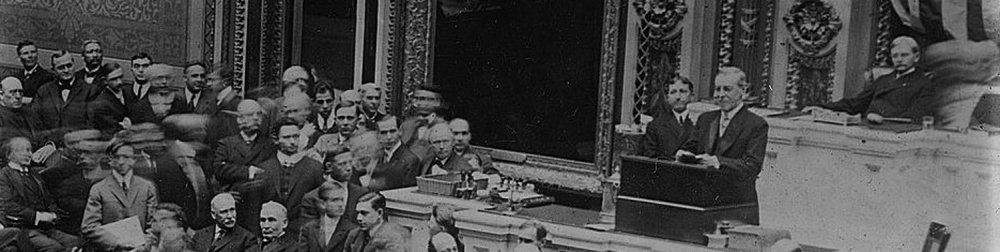
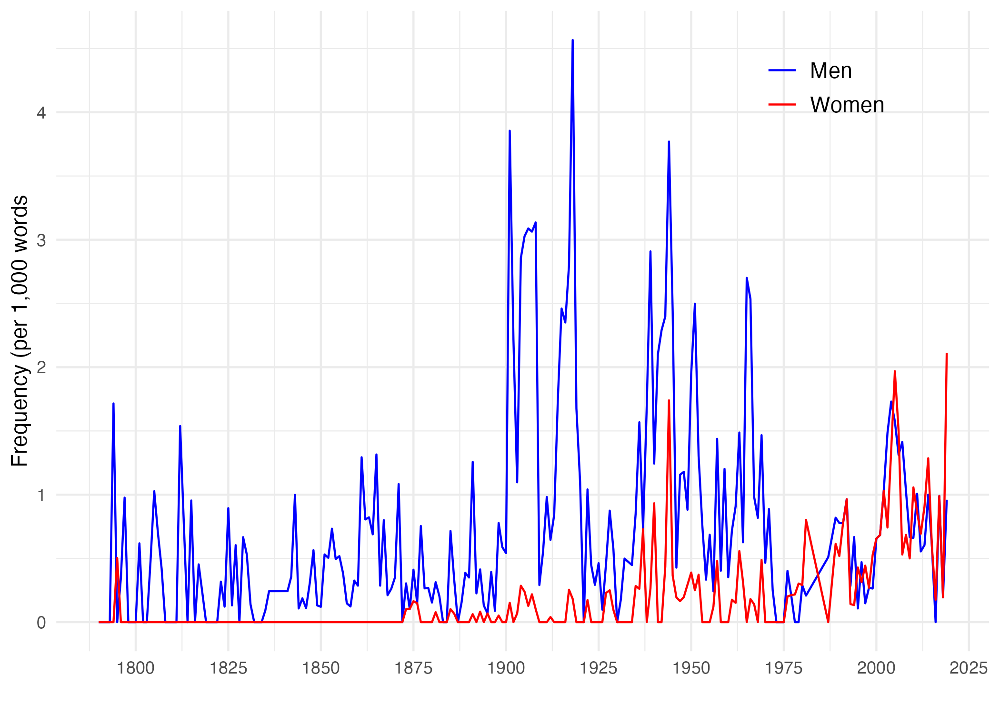
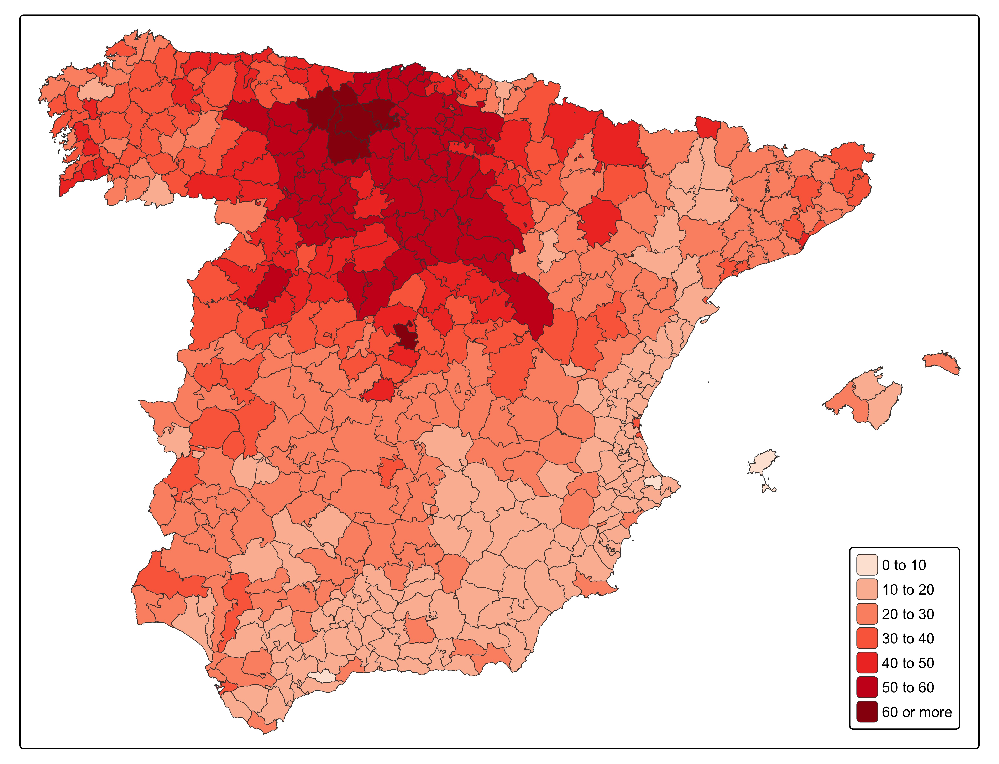

## Welcome to quantification in history!

::: {.callout-note appearance="simple"}
September 7-11, 2026 -- 09:15-16:00 -- Room TBA ([Akrinn](https://maps.app.goo.gl/neGSMmi15nzrfNyr5), Kalvskinnet)

:::

Instructors: [Francisco J. Beltrán Tapia](https://fjbeltrantapia.github.io) / [Elise Barring Berggren](https://www.ntnu.edu/employees/elise.b.berggren)

::: {.column-margin}  
::: {style="font-size: 0.8em;"}
{width=100% height=100% fig-align="center"}

{width=100% height=100%} 
State of the Union Presidential Address (Woodrow Wilson - December 2, 1913) and relative frequency of the terms "men" and "women" in the State of the Union Speeches, 1790-2019

\

\

{width=100% height=100%} 

{width=100% height=100%} 

Household register card (Spanish population census) and percentage of the male population who were able to read and write, 1860
:::
:::

This MA/PhD course, offered by the [Faculty of Humanities](https://www.ntnu.edu/hf) at the [Norwegian University of Science and Technology](https://www.ntnu.edu), provides a practical introduction on how historians can use computational tools to learn about the past.

## Description

Digital access to historical records is now available on an unprecedent scale. Millions of newspapers, government documents, letters and diaries, among other sources, are only one click away and completely searchable. Similarly, complete population censuses, birth, death and marriage records, military and prisons registers, and other sources have been digitised and made available online.

How can we make sense of this ever-increasing wealth of information? Computational methods permit extracting and analysing huge amounts of information, both textual and numerical, that would be impossible otherwise. Supplementing traditional qualitative methods with computing methods not only allows shedding new light into old questions, but also addressing new ones. Likewise, digital tools help visualising information in innovative and powerful ways, thus producing compelling arguments and stories.

This course provides an in-depth introduction to quantitative methods, covering some of the techniques most widely used in research in the historical and social sciences. This hands-on course shows how to apply quantitative methods to historical information, both textual and numerical, keeping statistical theory and mathematics to a minimum. The goal is to provide students with the tools to critically engage with the literature relying on quantitative methods and to be able to conduct original research using those tools either in academia, the public, or the business sector. In the process, students will master R, a free statistical software widely used by practitioners in many different fields.

The course is taught intensively during one week (morning and afternoon sessions; 30 hours in total). Each session combines lectures and computer practicals using R. Students will learn by applying the different concepts to real data used by historians. 

The course is open to Master and PhD students. No previous background in computing or statistics is required. For more information, contact [Francisco J. Beltrán Tapia](https://fjbeltrantapia.github.io). 

::: {.callout-important}
### Important warning

Please follow the [Instructions](instructions.html) section to prepare for the course in advance. As well as reading the article [Quantifying history]{.underline}, this involves downloading the [course materials]{.underline}, installing and getting familiar with [R]{.underline} and [RStudio]{.underline} and going through the background information on the [case-studies]{.underline} we will be exploring.

:::
